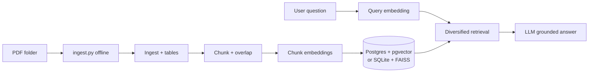

# Vectera take-home — RAG over investment PDFs

Submission for the **Vectera.ai** RAG technical assessment.

This project is a Retrieval-Augmented Generation (RAG) system for investment PDFs: structured, **source-grounded** answers over multiple documents, versions, and conflicting information.

You **index offline** with `python ingest.py ./folder` (company/version flags per batch), then **query in Streamlit** — answers **stick to retrieved text** with **citations**, not outside knowledge. It also tries to handle **multiple versions of the same issuer**, **documents that disagree**, and **chart-heavy slides** where extraction is thin.

This is a demo / prototype, not production infrastructure.

---

## Two-phase operation

The pipeline is split so **heavy work runs once** and the **UI stays query-only** (scalable pattern: batch index in CI or a worker, serve retrieval + LLM in the app).

### Phase 1 — Offline ingestion (once per document / batch)

Documents are **read from disk**, **chunked**, **embedded**, and **written** to storage (`data/vectera.db` + `data/faiss.index` for SQLite, or Postgres + pgvector when `DATABASE_URL` is set). The FAISS index is **explicitly saved** after each batch append (`faiss.write_index`); the DB holds chunk metadata and (on Postgres) vectors in-row.

```bash
# Put PDFs in a folder (e.g. ./data), then:
python ingest.py ./data
# Optional: same company/version for every file in the folder
python ingest.py ./data --company "Acme Corp" --version Q3-2024 --client default
# Include subfolders:
python ingest.py ./data --recursive
```

### Phase 2 — Query-time retrieval (Streamlit)

The app **does not** ingest PDFs. It **loads** the existing index (FAISS from disk on each search via `faiss_store.load_index()`, or Postgres via `DATABASE_URL`), embeds **only the user question**, retrieves chunks, and calls the LLM. **Retrieval, prompts, conflict handling, and output format are unchanged** (`src/retrieval.py`, `src/rag.py`).

```bash
streamlit run app.py
```

### LLM usage vs indexing (important)

**An LLM is not used to chunk or index documents.** Ingestion is deterministic code plus local embeddings:

| Step | Implementation | Uses GPT / chat API? |
|------|----------------|----------------------|
| PDF text / tables | `src/ingestion.py` (`pdfplumber`) | **No** |
| Chunking | `src/chunking.py` (structure-first splits) | **No** |
| Chunk vectors | `src/embeddings.py` (`sentence-transformers`, local) | **No** |
| Persist metadata + vectors | Postgres **pgvector** or SQLite + on-disk **FAISS** | **No** |
| User’s question → answer | `src/rag.py` (OpenAI-compatible API or Ollama) | **Yes** (query-time only) |

So: **index once** via `ingest.py`, **reuse** the vector store for every session. The UI does not re-ingest PDFs.

**Scale (10k–20k+ documents):** the intended production shape is **managed Postgres + pgvector** (or equivalent vector DB), **batch/worker ingestion** (many `ingest.py`-style jobs or a queue), and **tuned ANN indexes** (e.g. HNSW / IVFFLAT). The **SQLite + FAISS** path is for local development; it is not the target topology at tens of thousands of documents.

---

## Quick start

```bash
cd Vectera
python3 -m venv .venv && source .venv/bin/activate   # Windows: .venv\Scripts\activate
pip install -r requirements.txt
# Free path: install Ollama, then: ollama pull llama3.2  and keep Ollama running (app or ollama serve).
# No .env file required — if OPENAI_API_KEY is unset, the app defaults to local Ollama.
# Optional: cp .env.example .env  to pin settings.
# 1) Index PDFs (put .pdf files in ./data or point to another folder)
python ingest.py ./data
# 2) Query the pre-built index
streamlit run app.py
# Or one shot (starts Ollama if needed): ./scripts/run.sh
```

**Free stack:** **Ollama** (answers) + **sentence-transformers** (embeddings) + **SQLite + FAISS** (no `DATABASE_URL`). No API keys. If you set `OPENAI_API_KEY` and leave `USE_OLLAMA` unset, the app switches to **cloud**; use `USE_OLLAMA=1` to force Ollama anyway.

**Postgres + pgvector** (closer to the “managed DB” ask): `docker compose up -d`, then set `DATABASE_URL` in `.env` as in `.env.example`. If you don’t have Docker, the app falls back to **SQLite + FAISS** under `data/` — run `ingest.py` with that configuration; the same index is reused across Streamlit sessions.

---

## System architecture (high-level)

1. **Ingestion** (`src/ingestion.py`) — `pdfplumber` pulls text per page. Tables get flattened to text when extraction works. If a page is basically empty but looks image-heavy, I attach a short note so we don’t pretend we read the chart.
2. **Chunking** (`src/chunking.py`) — I split on paragraphs first, then sentence-ish boundaries, merge tiny fragments, and only then use overlap. I didn’t want a dumb fixed-token window over arbitrary cut points.
3. **Embeddings** (`src/embeddings.py`) — local `sentence-transformers` so indexing doesn’t depend on an embedding API.
4. **Storage** (`src/persistence.py`) — one code path, two backends:
   - **Postgres + pgvector** when `DATABASE_URL` is set (vectors live in the `embedding` column).
   - **SQLite + FAISS** when it isn’t — simpler for local dev; `faiss_store.save_index` persists the index after ingestion.
5. **Offline ingest** (`ingest.py` → `src/pipeline.py`) — reads PDFs from a folder, runs steps 1–4 once, and persists the index / rows for reuse.
6. **Retrieval** (`src/retrieval.py`) — at query time: embed the question, vector search, diversify — unchanged.
7. **Answering** (`src/rag.py`) — OpenAI-compatible chat API (works with **Ollama** too). The system prompt is strict: **only use context**, **don’t merge conflicts**, **attribute by version**, and **output Answer / Key Points / Conflicts / Sources** so citations aren’t buried.
8. **UI** (`app.py`) — Streamlit: **query only** — optional client filter, question, and an expander with **raw retrieved chunks** so you can sanity-check the model.



---

## How I used the database (Snowflake vs equivalent)

The brief mentions **Snowflake** first; I’m using **PostgreSQL + pgvector** as the **equivalent** path — same idea: relational store for metadata + chunks, vectors in the database for similarity search when you’re on Postgres. `docker-compose.yml` spins up a pgvector image; **Supabase / Neon / RDS** work the same way with a `DATABASE_URL`.

If I had a Snowflake account and more time, I’d keep this **retrieval + prompt** shell and move storage behind a Snowflake-native layer (stage for PDFs, tables for chunks, Cortex Search or a vector column — same separation of concerns, different connector).

**Schema:** `documents` and `chunks`; on Postgres, `chunks.embedding` is `vector(384)` by default (must stay in sync with `EMBEDDING_DIM` / the embedding model).

**ANN index (production):** for large chunk counts, build an **HNSW** index on `chunks.embedding` so similarity search is sublinear instead of scanning every row. After ingest (or after a big bulk load), run:

```bash
psql "$DATABASE_URL" -f scripts/pgvector_hnsw.sql
```

On a live database with heavy traffic, use `CREATE INDEX CONCURRENTLY` (see comments in that file). Tune `m` / `ef_construction` in SQL if your ops team standardizes on different recall/latency tradeoffs.

---

## Production scale (10k–20k documents and beyond)

What actually changes when you leave “laptop demo” behind:

| Piece | Dev | Production-oriented |
|-------|-----|---------------------|
| Vector store | SQLite + flat FAISS | **Postgres + pgvector** (managed: RDS, Neon, Supabase, etc.) |
| Similarity search | Full scan or flat index | **HNSW** (or IVFFLAT) on `embedding` |
| Ingest | `ingest.py` on one machine | **Workers / queue** (Celery, SQS+Lambda, Airflow) calling the same pipeline |
| PDF bytes | Local `data/uploads` | **Object storage** (S3, GCS); DB holds URI + hash |
| Deduping | None | **Content hash** per file; skip or version if already indexed |
| App tier | Streamlit | **API** (FastAPI) + separate web UI; horizontal replicas, no heavy ingest in request path |

**Brownie-point extras** that signal you’ve thought past the take-home: hybrid **BM25 + vector** retrieval; a tiny **eval set** (JSON of questions + expected source pages); **structured logs** with retrieve latency; idempotent ingest keyed by `sha256`.

---

## Chunking strategy

Paragraphs first, then sentence-like splits for oversized blocks, merge small bits, overlap only when I still need to split a long block. Tradeoff: it’s predictable and cheap, but ugly PDFs can still split mid-thought.

---

## Retrieval approach

Pull more candidates than the LLM sees (`RETRIEVAL_CANDIDATES` in `src/config.py`), then greedily pick with a **per-document cap** (`MAX_CHUNKS_PER_DOCUMENT_IN_BATCH`). Optional **cross-company swap** if the top set is all one company but another company exists in the candidates. Tradeoff: diversity can shave a bit of raw similarity score — I prefer that over single-source answers for multi-doc questions.

---

## Version awareness

I don’t try to guess “which fiscal year” from the PDF body — that’s brittle. At **ingest** you set a **version label** (e.g. `Q3-2024`) via `ingest.py --version`. It’s stored on every chunk and fed into the prompt so answers can say “according to **version X** …” without silently merging numbers across versions.

---

## Conflicting information

Retrieval tries to surface more than one relevant excerpt; the prompt tells the model **not** to blend conflicting facts and to use the **Conflicts** section. I still don’t trust the UI output blindly — **Retrieved context** is there so you can verify what it actually saw.

---

## Charts, tables, and structured content

Tables: `pdfplumber` `extract_tables()` → text in the chunk when it works. Charts: often there’s nothing reliable to extract; I flag that on the page so the model doesn’t invent series. The prompt also says not to blame “chart extraction” unless that note actually appears in context (rule 7 in `src/rag.py`).

---

## Multi-client (optional — how I’d go further)

There’s a **Client / workspace** field and `client_label` on documents. In Postgres, listing and search can filter by it — it’s a lightweight stand-in for tenants. For real access control I’d wire identity → `tenant_id`, row-level security in Postgres, encrypted file storage, and audit logs — not something I fully built here.

---

## Known limitations

- No OCR for scanned PDFs.
- Off-the-shelf embeddings, not finance-tuned.
- SQLite path has no server-side RLS; use Postgres for a “real” deployment story.
- Change embedding model/dimension → re-ingest.

---

## What I’d do with more time

Hybrid retrieval (BM25 + vectors) for tickers and exact strings, OCR for image-only pages, a small eval set with golden answers, Snowflake behind the same `persistence` interface, and vector index tuning (IVFFLAT / HNSW) at scale.

---

## How this maps to the official brief

The take-home asked for Python; a **database layer** (Snowflake preferred or Postgres/Supabase/etc.); **ingest → chunk → embed → retrieve → LLM** with **citations**; a **non-CLI UI** (I used Streamlit); awareness of **versions**, **conflicts**, and **charts/tables**; and a README covering architecture, DB, chunking, retrieval, those three topics, limitations, and improvements — that’s what the sections above are.

**Concrete file pointers:** batch entrypoint `ingest.py`, pipeline `src/pipeline.py`, extraction `src/ingestion.py`, chunking `src/chunking.py`, embeddings `src/embeddings.py`, retrieval `src/retrieval.py`, DB routing `src/persistence.py`, Postgres `src/postgres_db.py`, SQLite + FAISS `src/database.py` + `src/faiss_store.py`, prompts `src/rag.py`, query UI `app.py`.

**Example questions** (from the brief — good for a demo):

- What is [Company X]’s key strategy?
- How has [metric] changed across document versions?
- What drives demand according to these materials?
- Are there conflicting data points across documents?
- Summarize key trends shown in the documents

**Deliverables:** query UI (`app.py`), offline indexer (`ingest.py`), this README, setup via `.env.example`, submission notes in `SUBMISSION.md`, push help in `PUSH_TO_GITHUB.md` (you still need to push with your own GitHub account).

---

## Run the app

```bash
python ingest.py ./data   # index PDFs first
streamlit run app.py      # query only
```

Or `./scripts/run.sh` to start Streamlit after deps (run `ingest.py` yourself when the index changes).

---

## Repository layout

```
README.md              # you are here
.env.example           # copy to .env
ingest.py              # offline: PDF folder → chunk → embed → persist
PUSH_TO_GITHUB.md      # git push steps
app.py                 # Streamlit query UI (no document ingestion)
docker-compose.yml     # Postgres + pgvector
scripts/run.sh         # helper launcher
scripts/pgvector_hnsw.sql  # optional HNSW index for Postgres at scale
SUBMISSION.md          # handoff checklist
src/
  config.py
  ingestion.py
  chunking.py
  embeddings.py
  persistence.py
  postgres_db.py
  database.py
  faiss_store.py
  retrieval.py
  rag.py
  pipeline.py
```

---

