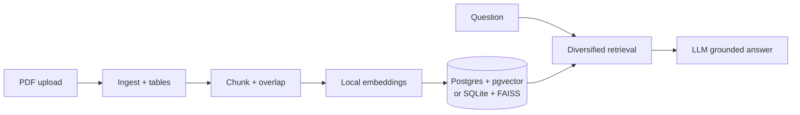

# Vectera take-home — RAG over investment PDFs

Hi — this is my submission for the **Vectera.ai RAG technical assessment**.

I wanted something I could actually run end-to-end on a laptop: upload PDFs, ask questions, and get answers that **stick to the retrieved text** with **citations**, instead of the model free-styling. Along the way I tried to handle the messy stuff that shows up in real decks — **multiple versions of the same company**, **documents that disagree**, and **slides that are mostly charts** (where extraction falls apart).

This isn’t production infrastructure; it’s a honest slice of how I’d structure the problem and where I’d cut corners.

---

## Quick start

```bash
cd Vectera
python3 -m venv .venv && source .venv/bin/activate   # Windows: .venv\Scripts\activate
pip install -r requirements.txt
cp .env.example .env
# Edit .env — at minimum USE_OLLAMA=1 or set OPENAI_API_KEY
streamlit run app.py
```

For a **local LLM** with no API bill: install [Ollama](https://ollama.com), run `ollama pull llama3.2`, keep `USE_OLLAMA=1` in `.env`, and have `ollama serve` running. Embeddings use **sentence-transformers** locally either way.

**Postgres + pgvector** (closer to the “managed DB” ask): `docker compose up -d`, then set `DATABASE_URL` in `.env` as in `.env.example`. If you don’t have Docker, the app falls back to **SQLite + FAISS** under `data/` — I used that a lot while iterating; it’s fine to say so in a demo.

---

## System architecture (high-level)

1. **Ingestion** (`src/ingestion.py`) — `pdfplumber` pulls text per page. Tables get flattened to text when extraction works. If a page is basically empty but looks image-heavy, I attach a short note so we don’t pretend we read the chart.
2. **Chunking** (`src/chunking.py`) — I split on paragraphs first, then sentence-ish boundaries, merge tiny fragments, and only then use overlap. I didn’t want a dumb fixed-token window over arbitrary cut points.
3. **Embeddings** (`src/embeddings.py`) — local `sentence-transformers` so indexing doesn’t depend on an embedding API.
4. **Storage** (`src/persistence.py`) — one code path, two backends:
   - **Postgres + pgvector** when `DATABASE_URL` is set (vectors live in the `embedding` column).
   - **SQLite + FAISS** when it isn’t — simpler for local dev.
5. **Retrieval** (`src/retrieval.py`) — I grab a larger pool of hits, then **cap how many chunks come from one PDF** so a single long deck doesn’t drown everything else. If another company is sitting in the candidate list, I try to swap one chunk in so you get cross-document signal.
6. **Answering** (`src/rag.py`) — OpenAI-compatible chat API (works with **Ollama** too). The system prompt is strict: **only use context**, **don’t merge conflicts**, **attribute by version**, and **output Answer / Key Points / Conflicts / Sources** so citations aren’t buried.
7. **UI** (`app.py`) — Streamlit: upload, company + version + optional client/workspace, question, and an expander with **raw retrieved chunks** so you can sanity-check the model.



---

## How I used the database (Snowflake vs equivalent)

The brief mentions **Snowflake** first; I’m using **PostgreSQL + pgvector** as the **equivalent** path — same idea: relational store for metadata + chunks, vectors in the database for similarity search when you’re on Postgres. `docker-compose.yml` spins up a pgvector image; **Supabase / Neon / RDS** work the same way with a `DATABASE_URL`.

If I had a Snowflake account and more time, I’d keep this **retrieval + prompt** shell and move storage behind a Snowflake-native layer (stage for PDFs, tables for chunks, Cortex Search or a vector column — same separation of concerns, different connector).

**Schema:** `documents` and `chunks`; on Postgres, `chunks.embedding` is `vector(384)` by default (must stay in sync with `EMBEDDING_DIM` / the embedding model).

---

## Chunking strategy

Paragraphs first, then sentence-like splits for oversized blocks, merge small bits, overlap only when I still need to split a long block. Tradeoff: it’s predictable and cheap, but ugly PDFs can still split mid-thought.

---

## Retrieval approach

Pull more candidates than the LLM sees (`RETRIEVAL_CANDIDATES` in `src/config.py`), then greedily pick with a **per-document cap** (`MAX_CHUNKS_PER_DOCUMENT_IN_BATCH`). Optional **cross-company swap** if the top set is all one company but another company exists in the candidates. Tradeoff: diversity can shave a bit of raw similarity score — I prefer that over single-source answers for multi-doc questions.

---

## Version awareness

I don’t try to guess “which fiscal year” from the PDF body — that’s brittle. At upload you set a **version label** (e.g. `Q3-2024`). It’s stored on every chunk and fed into the prompt so answers can say “according to **version X** …” without silently merging numbers across versions.

---

## Conflicting information

Retrieval tries to surface more than one relevant excerpt; the prompt tells the model **not** to blend conflicting facts and to use the **Conflicts** section. I still don’t trust the UI output blindly — **Retrieved context** is there so you can verify what it actually saw.

---

## Charts, tables, and structured content

Tables: `pdfplumber` `extract_tables()` → text in the chunk when it works. Charts: often there’s nothing reliable to extract; I flag that on the page so the model doesn’t invent series. The prompt also says not to blame “chart extraction” unless that note actually appears in context (rule 7 in `src/rag.py`).

---

## Multi-client (optional — how I’d go further)

There’s a **Client / workspace** field and `client_label` on documents. In Postgres, listing and search can filter by it — it’s a lightweight stand-in for tenants. For real access control I’d wire identity → `tenant_id`, row-level security in Postgres, encrypted file storage, and audit logs — not something I fully built here.

---

## Known limitations

- No OCR for scanned PDFs.
- Off-the-shelf embeddings, not finance-tuned.
- SQLite path has no server-side RLS; use Postgres for a “real” deployment story.
- Change embedding model/dimension → re-ingest.

---

## What I’d do with more time

Hybrid retrieval (BM25 + vectors) for tickers and exact strings, OCR for image-only pages, a small eval set with golden answers, Snowflake behind the same `persistence` interface, and vector index tuning (IVFFLAT / HNSW) at scale.

---

## How this maps to the official brief

The take-home asked for Python; a **database layer** (Snowflake preferred or Postgres/Supabase/etc.); **ingest → chunk → embed → retrieve → LLM** with **citations**; a **non-CLI UI** (I used Streamlit); awareness of **versions**, **conflicts**, and **charts/tables**; and a README covering architecture, DB, chunking, retrieval, those three topics, limitations, and improvements — that’s what the sections above are.

**Concrete file pointers:** ingestion `src/ingestion.py`, chunking `src/chunking.py`, embeddings `src/embeddings.py`, retrieval `src/retrieval.py`, DB routing `src/persistence.py`, Postgres `src/postgres_db.py`, SQLite + FAISS `src/database.py` + `src/faiss_store.py`, prompts `src/rag.py`, UI `app.py`.

**Example questions** (from the brief — good for a demo):

- What is [Company X]’s key strategy?
- How has [metric] changed across document versions?
- What drives demand according to these materials?
- Are there conflicting data points across documents?
- Summarize key trends shown in the documents

**Deliverables:** working app (`app.py`), this README, setup via `.env.example`, demo script in `DEMO.md`, submission notes in `SUBMISSION.md`, push help in `PUSH_TO_GITHUB.md` (you still need to push with your own GitHub account).

---

## Run the app

```bash
streamlit run app.py
```

Or `./scripts/run.sh` if you want it to try Ollama + deps in one go.

---

## Repository layout

```
README.md              # you are here
.env.example           # copy to .env
PUSH_TO_GITHUB.md      # git push steps
app.py                 # Streamlit UI
docker-compose.yml     # Postgres + pgvector
scripts/run.sh         # helper launcher
DEMO.md                # demo script
SUBMISSION.md          # handoff checklist
src/
  config.py
  ingestion.py
  chunking.py
  embeddings.py
  persistence.py
  postgres_db.py
  database.py
  faiss_store.py
  retrieval.py
  rag.py
  pipeline.py
```

---

Thanks for reading — happy to walk through any of this live.
